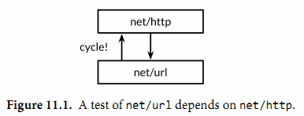

关于测试的必要性，这里就不多说了，很多人反感写测试代码，觉得浪费时间。但实际上写好测试代码后，后期代码调整，能够节省大量的调试时间。

### 基础知识补充

Go本身提供了完善的测试命令go test和testing标准库。用法也很简单。

假设有一个calc.go的文件，里面有Add函数一个，现在要对Add函数做单元测试

```go
package calc

func Add (argOne, argTwo int) int {
    return argOne + argTwo
}
```

1.在calc包目录下面新建一个calc_test.go文件。xxxx_test.go是Go框架默认的测试文件命名规范，该文件会被特殊处理，在go build时不会被打包到项目内。还有一个特殊的规则，在运行测试的时候，calc_test.go和calc.go并不处于同一个包内，比如calc_test.go文件无法访问calc.go文件内未导出的变量/函数。这个特性可以很好的解决golang循环依赖的问题。

考虑下这两个包：net/url包，提供了URL解析的功能；net/http包，提供了web服务和HTTP客户端的功能。如我们所料，上层的net/http包依赖下层的net/url包。然后，net/url包中的一个测试是演示不同URL和HTTP客户端的交互行为。也就是说，一个下层包的测试代码导入了上层的包。



如上图，这样的行为在net/url包的测试代码中会导致包的循环依赖，Go语言规范是禁止包的循环依赖的。

不过我们可以通过在net/url包所在的目录声明一个独立的url_test测试包。其中包名的`_test`后缀告诉go test工具它应该建立一个额外的包来运行测试。我们可以将这个测试包的导入路径视作是net/url_test，这样会更容易理解。在设计层面，url_test测试包是在所有它依赖的包的上层，如下图。


通过避免循环的导入依赖，test测试包可以更灵活地编写测试，特别是集成测试（需要测试多个组件之间的交互），可以像普通应用程序那样自由地导入其他包，而不用担心循环依赖问题。

2.新建函数名为TestXxx，参数为*testing.T的函数。函数命名必须以Test开头，后面的命名首字母必须为大写，同时参数必须是唯一的*testing.T类型，不能有返回值。函数内需通过Error/Fatal等方法在不符合测试结果的情况下抛出错误。

```go
package calc

import "testing"

func TestAdd(t *testing.T) {
    one := 1
    two := 2
    if add(one, two) != 2 {
        t.Error("one add two is not equal to 2")
    }
}
```

3.在当前目录的终端下面，运行go test命令，即可看到类似如下的测试结果。

```
--- FAIL: TestAdd (0.00s)
	calc_test.go:12: one add two is not equal to 2
FAIL
exit status 1
FAIL	awesomeProject1 0.019s
```

上面会显示测试的结果（如果是测试通过，会显示为PASS），并且显示对应的测试函数名称，以及代码运行时间。

上面是Go单元测试的最基础应用，更加详细的命令可以在终端运行go help test或go help testflag了解。下面两种方式比较常用：

1) go test -v  //会详细显示所有测试函数运行细节

2) go test -run TestXxx  //在文件内包含多个TestXxx函数时，指定运行某一个测试函数

### 表驱动测试（Table Driven Test）

原作者推荐的test文件最佳实践，事实上也是官方标准库里面最常见的test范例，示例代码如下：

```go
func TestSplit(t *testing.T) {
    //官方标准库喜欢把变量写在Test函数体外面，更有助于代码阅读和修改
    //声明一个结构体的map，并且用string作为key区分不同的测试案例，struct结构体内包含了用于测试用的相关字段，字段可以自由定义。
    tests := map[string]struct {
        input string
        sep   string
        want  []string
    }{
        //采用map结构，可以很方便的添加或者删除测试用例
        "simple":       {input: "a/b/c", sep: "/", want: []string{"a", "b", "c"}},
        "wrong sep":    {input: "a/b/c", sep: ",", want: []string{"a/b/c"}},
        "no sep":       {input: "abc", sep: "/", want: []string{"abc"}},
        "trailing sep": {input: "a/b/c/", sep: "/", want: []string{"a", "b", "c"}},
    }
    
    for name, tc := range tests { 
        t.Run(name, func(t *testing.T) {  //name这里很关键，不然只知道出错，但是不知道具体是上面4个测试用例中哪一个用例出错。
            got := Split(tc.input, tc.sep)
            if !reflect.DeepEqual(tc.want, got) {
                t.Fatalf("expected: %v, got: %v", tc.want, got)
            }
        })
    }
}
```

运行go test后，测试结果大概会是以下的样子：

```go
--- FAIL: TestSplit (0.00s)		//出现fail的测试函数名称
split_test.go:25: trailing sep: expected: [a b c], got: [a b c ] //打印出现错误的测试用例对应的key，并且打印预期的结果，和目前测试得到的结果，可以很清晰的对比，并且找到出现错误的原因。
```

更复杂的应用，可以参考学习一下官方标准库里面fmt包下面的fmt_test.go源码里的TestSprintf函数。

原作者还推荐了一个IDE插件，可以方便快捷的生成table-driven test的struct代码，支持主流的sublime、vscode、golang等IDE编辑器。插件地址：https://github.com/cweill/gotests

### Testdata目录和Golden文件

在go build指令打包时，会自动忽略testdata目录里面的内容，并且在运行go test指令时，会将test文件所在目录设置为根目录，可以直接使用相对路径testdata引入或者存储相关文件，这是一个很有用的特性。通常我们会把一些较大的文件，如json文件，txt等文本文件存储在testdata目录下面，或者下面提到的.golden文件。下面是一个例子：

```go
func helperLoadBytes(t *testing.T, name string) []byte {
    path := filepath.Join("testdata", name) // 相对路径
    bytes, err := ioutil.ReadFile(path)
    if err != nil {
        t.Fatal(err)
    }
    return bytes
}
```

.golden文件在官方标准库内被用到，详细可以参加官方标准库cmd/gofmt/gofmt_test.go源码。标准库中，通过.input文件输入测试的原始数据，把测试结果输出到.golden文件，这样可以很直观的对比输出后的结果和原来数据的差异，对那种输出比较复杂的情况特别有效。下面是一个例子：

```go
var update = flag.Bool("update", false, "update .golden files")
func TestSomething(t *testing.T) {
    actual := doSomething()
    Golden := filepath.Join("testdata", tc.Name+ ".golden" )
    if *update {
        ioutil.WriteFile(golden, actual, 0644)
    }
    expected, _ := ioutil.ReadFile(golden)

    if !bytes.Equal(actual, expected) {
        // FAIL!
    }
}
```

### 结合Tags做测试

在*_test.go包最前面加入tag（注意：tag必须写在package语句之前，+build后面必须有一个空格，一个文件可以有多个tag声明），如下，其中tagName是自定义的名称：

```go
// +build tagName
package calc
```

通过 go test -tags=tagName 指令，可以指定只测试tag名为tagName的文件。这个规则常常用在集成测试上，或者结合版本控制来使用。但另外一个博主不推荐使用tags方式来进行测试，因为我们有时候很难识别到底哪个test文件捆绑了哪一个tag，而是推荐使用环境变量的方式。代码如下：

```go
func TestIntegration(t *testing.T) {
	fooAddr := os.Getenv("FOO_ADDR")
	if fooAddr == "" {
		t.Skip("set FOO_ADDR to run this test")   //Skip方法会跳过当前测试
	}

	f, err := foo.Connect(fooAddr)
	// ...
}
```

### 多线程测试

通过在测试函数内使用t.Parallel()来标志当前测试函数为并行测试模式，t.Parallel()会重置测试时间，通常在测试函数体中第一个被调用。并行的数量受 GOMAXPROCS 变量影响，也可以通过go test -parallel n的方式来指定并行测试的数量。并行测试的性能有待测试，在测试规则比较复杂，测试时间比较长的情况下，可能效果会比较明显，对于普通的测试函数，有可能会导致效率下降。

```go
func TestParallel(t *testing.T) {
	t.Parallel()
	// actual test...
}
```


### 参考资料
1. 5-testing-tips-in-go https://medium.com/star-gazers/5-testing-tips-in-go-3b7f79a546da
2. Go测试高级窍门与技巧 https://zhuanlan.zhihu.com/p/335484135
3. Go官方标准库文档 https://golang.org/doc/code#Testing
4. writing-table-driven-tests-in-go https://dave.cheney.net/2013/06/09/writing-table-driven-tests-in-go
5. GO语言圣经-测试函数 http://shouce.jb51.net/gopl-zh/ch11/ch11-02.html
6. dont-use-build-tags-for-integration-tests https://peter.bourgon.org/blog/2021/04/02/dont-use-build-tags-for-integration-tests.html
7. Go test少为人知的特性 https://zhuanlan.zhihu.com/p/141595243

